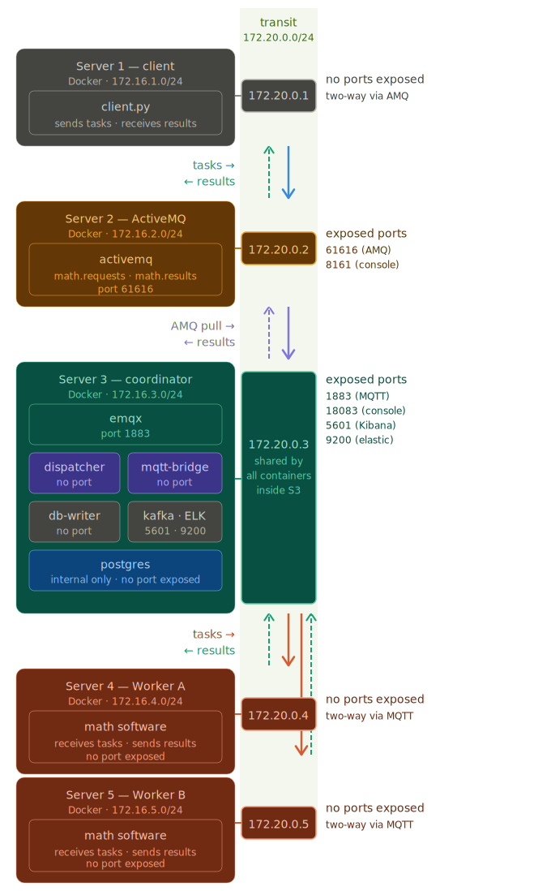

# Distributed Math Calculation System

A production-pattern distributed system built across **5 servers** using real VirtualBox VMs, message brokers, workers, persistence, streaming, and live dashboards — built from scratch as a hands-on learning project.



---

## Overview

This project demonstrates a fully working distributed architecture where a client sends math calculation requests that flow through multiple message brokers, get processed by load-balanced workers, and return results — while every calculation is simultaneously persisted to a database, streamed through Kafka, and visualized in real-time Kibana dashboards.

Every service is **production-hardened** with auto-reconnect logic, meaning the system survives any individual component restarting without manual intervention.

---

## Architecture

| Server | Role | Key Services |
|--------|------|-------------|
| **S1** (laptop) | Client | `client.py`, `load-generator.py`, `dlq_monitor.py` |
| **S2** (VM) | Message Broker | Apache ActiveMQ 5.18 |
| **S3** (VM) | Coordinator | EMQX, Dispatcher, MQTT-Bridge, DB-Writer, Kafka, Kafka-Producer, PostgreSQL, Elasticsearch, Logstash, Kibana |
| **S4** (VM) | Worker A | Math calculation worker |
| **S5** (VM) | Worker B | Math calculation worker |

### Request Flow

```
S1 client.py
    │
    ▼  STOMP :61613
S2 ActiveMQ (math.requests queue)
    │
    ▼  STOMP :61613
S3 Dispatcher (round-robin load balancer)
    │
    ▼  MQTT :1883
S3 EMQX (worker/a/tasks or worker/b/tasks)
    │
    ├──▶ S4 Worker A ──┐
    └──▶ S5 Worker B ──┤
                       │ MQTT worker/+/results
                       ▼
              S3 EMQX (results)
                 │
    ┌────────────┼────────────────┐
    ▼            ▼                ▼
S3 MQTT-Bridge  S3 DB-Writer    S3 Kafka-Producer
    │            │                │
    ▼            ▼                ▼
S2 math.results  PostgreSQL      Kafka
    │                             │
    ▼                             ▼
S1 client.py                  Logstash → Elasticsearch → Kibana
(result received)
```

---

## Tech Stack

- **Apache ActiveMQ 5.18** — STOMP message broker, request/response queues
- **EMQX 5.5** — MQTT broker, internal task/result routing
- **Python 3.12** — all custom services (dispatcher, bridge, workers, client)
- **PostgreSQL 16** — persistent result storage
- **Apache Kafka 3.7** (KRaft mode, no Zookeeper) — result streaming
- **Logstash 8.13** — Kafka → Elasticsearch pipeline
- **Elasticsearch 8.13** — result indexing and search
- **Kibana 8.13** — real-time dashboards
- **Docker Compose** — containerized deployment
- **VirtualBox** — VM isolation (Host-Only network `192.168.56.0/24`)

---

## Features

### Core Pipeline
- Math operations: `add`, `subtract`, `multiply`, `divide`, `sqrt`, `power`, `factorial`
- Round-robin load balancing across Worker A and Worker B
- Full request/response cycle with result returned to client

### Production Hardening
- **Auto-reconnect** on all services — survives ActiveMQ, PostgreSQL, and Kafka restarts
- **Dead Letter Queue monitoring** — alerts when messages fail and pile up
- **Request backlog alerting** — warns when `math.requests` exceeds threshold (dispatcher down)
- **Graceful error handling** — divide-by-zero and invalid operations return structured error responses

### Observability
- **Kibana dashboards** with 4 panels:
  - Average duration per operation (bar chart)
  - Success/error rate (pie chart)
  - Duration over time (line chart with proper `@timestamp`)
  - Recent calculations (live data table)
- **PostgreSQL audit trail** — every calculation permanently logged with timestamp, worker, duration
- **results_log.txt** — local file log on S1 of all requests and results

---

## Project Structure

```
repo/
├── README.md
├── final_clean_architecture.svg
├── server2/                        # S2 — ActiveMQ
│   ├── docker-compose.yml
│   └── activemq-config/
│       ├── activemq.xml            # STOMP + OpenWire connectors, queue policies
│       └── jolokia-access.xml      # REST API access config
├── server3/                        # S3 — Coordinator (10 containers)
│   ├── docker-compose.yml
│   ├── dispatcher/
│   │   ├── dispatcher.py           # Round-robin load balancer
│   │   └── Dockerfile
│   ├── bridge/
│   │   ├── bridge.py               # MQTT → ActiveMQ results bridge
│   │   └── Dockerfile
│   ├── db-writer/
│   │   ├── db_writer.py            # MQTT → PostgreSQL persistence
│   │   └── Dockerfile
│   ├── kafka-producer/
│   │   ├── kafka_producer.py       # MQTT → Kafka streaming
│   │   └── Dockerfile
│   └── logstash/
│       └── logstash.conf           # Kafka → Elasticsearch pipeline
├── server4/                        # S4 — Worker A
│   ├── docker-compose.yml
│   └── worker/
│       ├── worker.py
│       └── Dockerfile
├── server5/                        # S5 — Worker B (identical to S4)
│   ├── docker-compose.yml
│   └── worker/
│       ├── worker.py
│       └── Dockerfile
└── client/                         # S1 — Client scripts (run on laptop)
    ├── client.py                   # Single batch test
    ├── load-generator.py           # Continuous random load with auto-reconnect
    └── dlq_monitor.py              # Dead letter queue + backlog alerting
```

---

## Setup Guide

### Prerequisites
- VirtualBox with 4 Ubuntu Server VMs
- Host-Only network adapter configured: `192.168.56.0/24`
- Static IPs assigned: S2=`.2`, S3=`.3`, S4=`.4`, S5=`.5`
- Docker installed on each VM (`curl -fsSL https://get.docker.com | sh`)
- Python 3.x + `stomp.py` installed on laptop (`pip install stomp.py`)

### VM Resource Requirements

| VM | RAM | Disk |
|----|-----|------|
| S2 | 2GB | 20GB |
| S3 | 6GB | 40GB |
| S4 | 2GB | 20GB |
| S5 | 2GB | 20GB |

### Deployment

**S2 — ActiveMQ:**
```bash
cd ~/server2
sudo docker compose up -d
```

**S3 — All coordinator services:**
```bash
cd ~/server3
sudo docker compose up -d
```

**S4 — Worker A:**
```bash
cd ~/server4
sudo docker compose up -d
```

**S5 — Worker B:**
```bash
cd ~/server5
sudo docker compose up -d
```

**S1 — Run the client:**
```bash
pip install stomp.py
python client.py
```

### Startup Health Check
```bash
# On each VM — confirm all containers are Up
sudo docker compose ps

# Quick resource check on S3
free -h && df -h /

# End-to-end pipeline test from laptop
python client.py
```

---

## Monitoring

### Web Consoles
| Service | URL | Credentials |
|---------|-----|-------------|
| ActiveMQ | `http://192.168.56.2:8161` | admin / admin |
| EMQX | `http://192.168.56.3:18083` | admin / public |
| Kibana | `http://192.168.56.3:5601` | — |
| Elasticsearch | `http://192.168.56.3:9200` | — |

### DLQ Monitor
```bash
python dlq_monitor.py
```
Checks every 30 seconds — alerts if dead letter queue has messages or request backlog exceeds 10.

### Continuous Load Generator
```bash
python load-generator.py
```
Sends a random math operation every 10 seconds, prints results, logs to `results_log.txt`.

---

## Supported Operations

| Operation | Example | Result |
|-----------|---------|--------|
| add | `add([10, 20, 30])` | `60` |
| subtract | `subtract([100, 35])` | `65` |
| multiply | `multiply([7, 8])` | `56` |
| divide | `divide([100, 4])` | `25` |
| sqrt | `sqrt([144])` | `12` |
| power | `power([2, 10])` | `1024` |
| factorial | `factorial([10])` | `3628800` |

---

## Key Learning Outcomes

- **Networking** — subnets, CIDR notation, Host-Only vs bridge networking, port mapping
- **Message brokers** — STOMP vs MQTT protocols, queues vs topics, pub/sub patterns
- **Docker Compose** — declarative config, bridge networks, internal DNS, volume management
- **Distributed systems** — load balancing, fault tolerance, message persistence
- **LVM disk management** — extending logical volumes on live systems
- **ELK Stack** — Logstash pipelines, Elasticsearch indexing, Kibana Lens visualizations
- **Production hardening** — auto-reconnect patterns, dead letter queues, monitoring/alerting

---

## License

MIT
